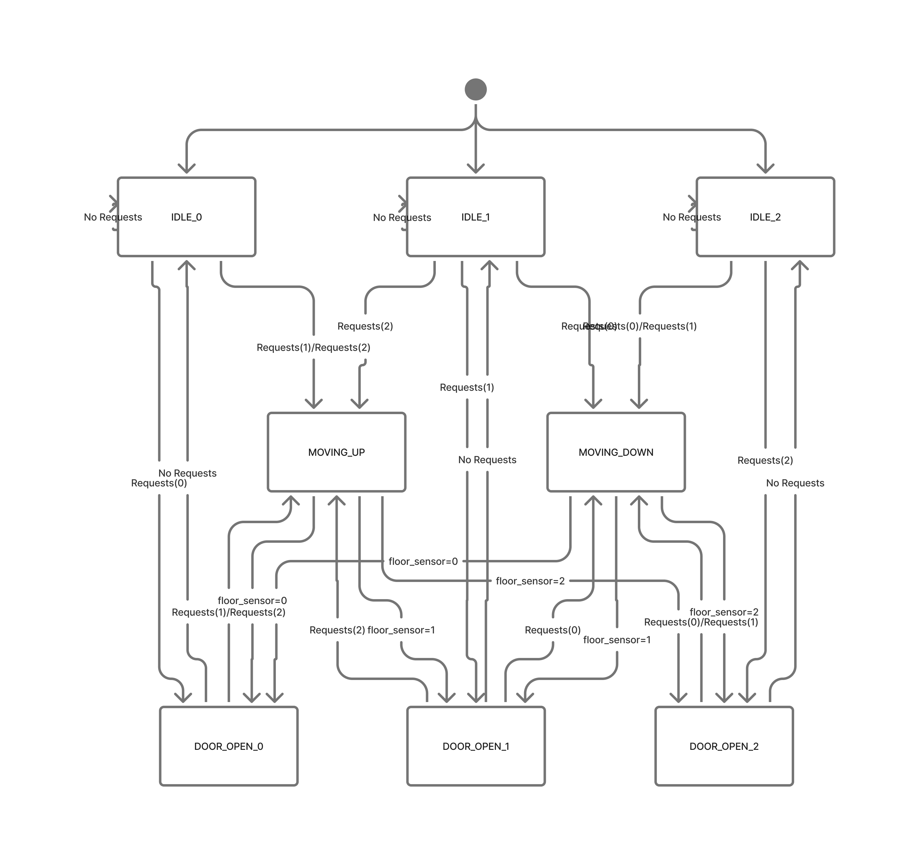

# Finite-State-Machine-based-Elevator-Controller
This project implements a Finite State Machine(FSM)-based elevator controller🛗 for a 3-floor elevator system. It is designed in VHDL and I might do it in verilog in the near future 😉.

I am currently writing a testbench in VHDL to test the FSM and make it better.

## More about the controller
- The controller manages
  - Motor direction control(Up/Down/Stop)
  - Safe door operations at each floor
  - Request handling from both call buttons(outside) and cabin buttons(inside)
  - Scheduling of requests for multiple ones
- I tried to imitate the real world scenarios by using all these.

## Features
- 8 FSM states : Idle at each floor, Moving up, Moving down and Door-open at each floor
- Door Timer : Keeps doors open for a fixed duration before resuming operations
- Motor Control : 2-bit motor signal ( 00 = stop, 10 = up, 01 = down)

## FSM Design📈

```mermaid
stateDiagram-v2
    [*] --> IDLE_0 : Reset

    %% Idle States
    IDLE_0 --> DOOR_OPEN_0 : Request(0)
    IDLE_0 --> MOVING_UP : Request(1) or Request(2)
    
    IDLE_1 --> DOOR_OPEN_1 : Request(1)
    IDLE_1 --> MOVING_UP : Request(2)
    IDLE_1 --> MOVING_DOWN : Request(0)
    
    IDLE_2 --> DOOR_OPEN_2 : Request(2)
    IDLE_2 --> MOVING_DOWN : Request(0) or Request(1)

    %% Door Open States
    DOOR_OPEN_0 --> IDLE_0 : Timer done & No request
    DOOR_OPEN_0 --> MOVING_UP : Request(1 or 2)
    
    DOOR_OPEN_1 --> IDLE_1 : Timer done & No request
    DOOR_OPEN_1 --> MOVING_UP : Request(2)
    DOOR_OPEN_1 --> MOVING_DOWN : Request(0)
    
    DOOR_OPEN_2 --> IDLE_2 : Timer done & No request
    DOOR_OPEN_2 --> MOVING_DOWN : Request(0 or 1)

    %% Moving States
    MOVING_UP --> DOOR_OPEN_1 : Floor=1 & Request(1)
    MOVING_UP --> DOOR_OPEN_2 : Floor=2 & Request(2)
    MOVING_UP --> MOVING_DOWN : Reached top & Requests below
    MOVING_UP --> IDLE_0 : Floor=0 & No request
    MOVING_UP --> IDLE_1 : Floor=1 & No request
    MOVING_UP --> IDLE_2 : Floor=2 & No request

    MOVING_DOWN --> DOOR_OPEN_1 : Floor=1 & Request(1)
    MOVING_DOWN --> DOOR_OPEN_0 : Floor=0 & Request(0)
    MOVING_DOWN --> MOVING_UP : Reached bottom & Requests above
    MOVING_DOWN --> IDLE_0 : Floor=0 & No request
    MOVING_DOWN --> IDLE_1 : Floor=1 & No request
    MOVING_DOWN --> IDLE_2 : Floor=2 & No request
````


## Learnings
- FSM design and hardware modelling in VHDL
- Request scheduling for real-world systems

## Author
Sai Vishal Reddy Malireddy
 
-- Undergrad, ⚡Electrical Major, IIT Bombay
